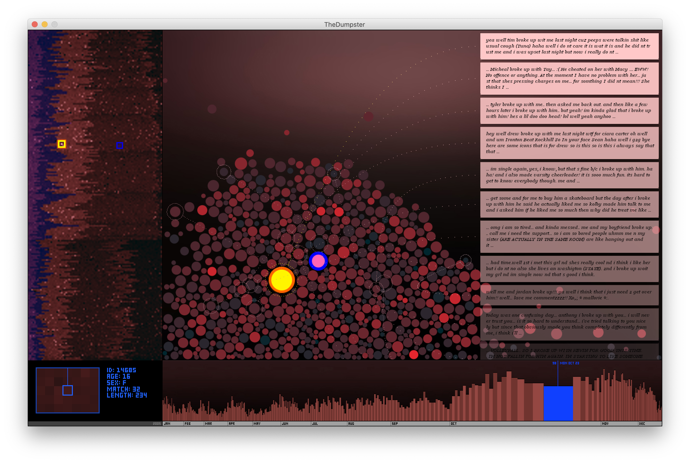

# The Dumpster

---

### Resources

* In `TheDumpster` directory: all code and data, 2013 restoration, with touchups (October 2020) to work in Processing 3.5.4, October 2020. (Be sure to uncompress the `text.zip` archive in the `data` directory).
* In the `archive` directory: 
  * `dumpsterAppletCW_060317_standalone.zip` (7MB): 2006 development version
  * `dumpster_deliver_1_2006.zip` (7MB): 2006 version delivered to Whitney/Tate
  * `Dumpster_2013.zip` (37MB): 2013 restored version, for Processing v.2.0b7, including compiled binaries for older operating systems.

---

### About *The Dumpster* (2006; restored 2013)
By Golan Levin with Kamal Nigam and Jonathan Feinberg 

*The Dumpster* (2006: [Golan Levin](http://www.flong.com/), [Kamal Nigam](http://www.kamalnigam.com/) and [Jonathan Feinberg](http://www.mrfeinberg.com/); restored 2013) is an interactive online visualization that attempts to depict a slice through the romantic lives of American teenagers. Using real postings extracted from millions of online blogs, visitors to the project can surf through tens of thousands of specific romantic relationships in which one person has "dumped" another. The project's graphical tools reveal the astonishing similarities, unique differences, and underlying patterns of these failed relationships, providing both peculiarly analytic and sympathetically intimate perspectives onto the diversity of global romantic pain.

#### Resources
* *The Dumpster* was previously available in a [Java applet online at the Whitney Artport](http://artport.whitney.org/commissions/thedumpster/dumpster.shtml).
* More information about *The Dumpster* can be found [here](http://artport.whitney.org/commissions/thedumpster/about.html) and [here](http://artport.whitney.org/commissions/thedumpster/statement.html).
* This 1'11" [YouTube video](http://www.youtube.com/watch?v=qKzQywUeyyE) provides a brief overview of *The Dumpster* visualization.
* Lev Manovich has written an article about *The Dumpster*, "[Social Data Browsing](http://www.tate.org.uk/netart/bvs/manovich.htm)".
* Press images of *The Dumpster* can be obtained from [this Flickr photoset](http://www.flickr.com/photos/golanlevin/sets/72157594393564798/).

#### Exhibition Information
*The Dumpster* was made possible by a commission from the [Whitney Artport](http://artport.whitney.org/) and the [Tate Online](http://www.tate.org.uk/netart/), and received enabling technical support from [Intelliseek](http://www.intelliseek.com/). *The Dumpster* has been exhibited at:

* *Data Mining*, A+D Gallery, Columbia College, Chicago. 10/2010.
* *Hybrid Geographies*, SUNY Stony Brook SAC Gallery. 11/2009.
* *Touched Design*, Artgadgets Center, Eindhoven, Netherlands. 5/2007.
* *The Dating Show*, Gallery at 3rd Ward, Brooklyn, NYC. 2/2007.
* *First IEEE InfoVis Art Exhibition*, Baltimore. 10/2006.
* *Further Processing: Generative Art, Open Systems*. Kunstverein Medienturm, Graz, Austria. 9/2006.
* *Time Shares: Fault Lines*. Rhizome.org / New Museum of Contemporary Art, NYC. 8/2006.
* *BildMuseet*. Umea University, Sweden. 5/2006.

---

### Licence

All materials [CC BY-NC-SA 4.0](https://creativecommons.org/licenses/by-nc-sa/4.0/) by Golan Levin with Kamal Nigam and Jonathan Feinberg  
